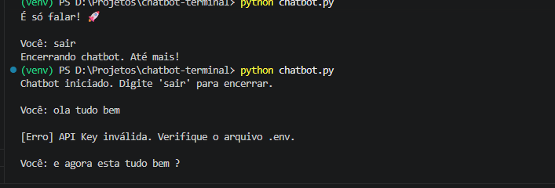
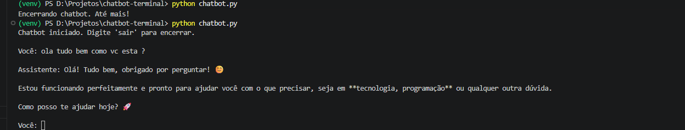
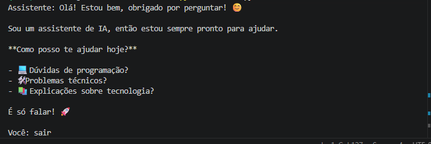

# Chatbot Terminal com IA

Um chatbot de linha de comando em Python que consome a API da Anthropic (Claude) para conversar com o usuário, manter contexto entre mensagens e ajudar no dia a dia.

Este projeto foi construído como exercício prático de retomada de Python, consumo de API e engenharia de prompt, com foco em transição para a área de AI Engineering.

## Demonstração

Conversa normal, com o histórico sendo mantido entre as mensagens:

Teste do tratamento de erro — API Key inválida sendo detectada sem travar o programa:

Após corrigir a chave, a conversa volta a funcionar normalmente:

## Tecnologias

- Python 3.13
- [Anthropic SDK](https://github.com/anthropics/anthropic-sdk-python) — comunicação com a API do Claude
- python-dotenv — gerenciamento seguro de variáveis de ambiente

## Funcionalidades

- Conversa contínua em loop, mantendo o histórico de mensagens entre os turnos
- Personalização de comportamento via *system prompt* (pode ser ajustado para se tornar, por exemplo, um secretário, um assistente técnico ou um administrador de tarefas, dependendo do que for instruído)
- Tratamento de erros específico para cada cenário de falha: conexão, autenticação, limite de uso e erros gerais da API
- Encerramento limpo do programa com o comando `sair`

## Como rodar o projeto localmente

### Pré-requisitos

- Python 3.10+ instalado
- Uma chave de API da Anthropic ([console.anthropic.com](https://console.anthropic.com))

### Passo a passo

\`\`\`bash
# 1. Clone o repositório
git clone https://github.com/seu-usuario/chatbot-terminal.git
cd chatbot-terminal

# 2. Crie e ative o ambiente virtual
python -m venv venv

# Windows
.\venv\Scripts\Activate

# Linux/Mac
source venv/bin/activate

# 3. Instale as dependências
pip install anthropic python-dotenv

# 4. Crie o arquivo .env na raiz do projeto com sua chave de API
echo ANTHROPIC_API_KEY=sua-chave-aqui > .env

# 5. Execute o chatbot
python chatbot.py
\`\`\`

Digite suas mensagens normalmente. Para encerrar, digite `sair`.

## O que aprendi construindo este projeto

- Como a API de um LLM funciona na prática: o modelo não possui memória própria — cada chamada é independente, e o histórico da conversa precisa ser reenviado a cada requisição para simular continuidade
- Engenharia de prompt aplicada: como o *system prompt* molda completamente o comportamento e a personalidade do assistente, permitindo adaptar o mesmo chatbot para diferentes finalidades
- Tratamento de erros específico por tipo de exceção, em vez de um bloco genérico, para dar respostas mais úteis ao usuário
- Gerenciamento seguro de credenciais usando variáveis de ambiente (`.env`) e `.gitignore`, evitando exposição de chaves de API em repositórios públicos
- Configuração de limites de gasto na API para evitar custos inesperados

## Melhorias futuras

- [ ] Salvar histórico de conversas em arquivo, permitindo retomar conversas anteriores
- [ ] Suporte a múltiplos *system prompts* pré-configurados (ex: modo secretário, modo programador)
- [ ] Interface simples em web ou desktop

## Autor

Desenvolvido por Arthur Sanches como parte de um plano de estudos em Python e AI Engineering.